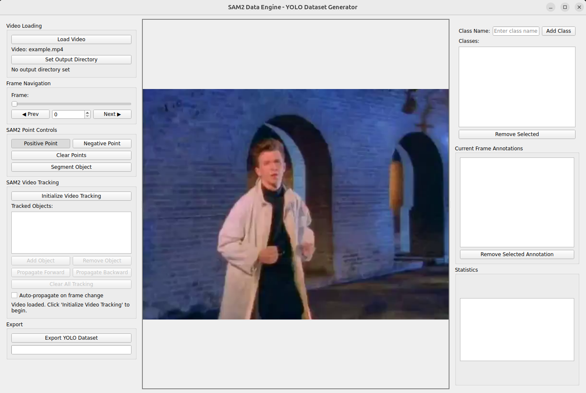

# SAM2 Data Engine - YOLO Dataset Generator

An automatic data engine GUI application that uses visual prompts to interact with SAM2 (Segment Anything Model 2) for generating YOLO training datasets with automatic video segmentation.


This implementation is a POC of the actual data engine that we want to build. It should serve as reference as the type of features we want to have.


### How to run this code?

It has a dockerfile to run the application.

First give access for the docker access the xserver with this command:

```bash
xhost +
```


Then run docker container with compose. Inside the directory run the following command:

```bash
docker compose up
```

You should see the following applicatation running.



